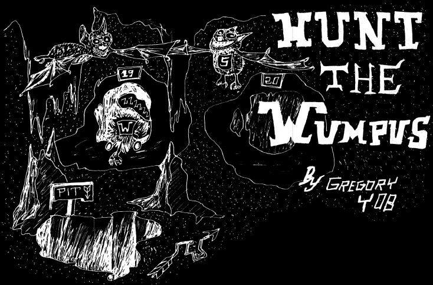

## Hunt the Wumpus - My Java version of "Hunt the Wumpus"
## A text-based adventure game developed by Gregory Yob in 1973

### Run the game
#### From main class **WumpusGame** (main class) and run it in the console.
```
C:\Users\jdk-11.0.7\bin>java -version
java version "11.0.7" 2020-04-14 LTS
Java(TM) SE Runtime Environment 18.9 (build 11.0.7+8-LTS)
Java HotSpot(TM) 64-Bit Server VM 18.9 (build 11.0.7+8-LTS, mixed mode)


C:\Users\Martin\Sandbox\jdk-11.0.7\bin>java -jar Wumpus.jar

/ \ /|/ \ /\/ \  /|/__ __\  /__ __\/ \ /|/  __/  / \  /|/ \ /\/ \__/|/  __\/ \ /\/ ___\
| |_||| | ||| |\ ||  / \      / \  | |_|||  \    | |  ||| | ||| |\/|||  \/|| | |||    \
| | ||| \_/|| | \||  | |      | |  | | |||  /_   | |/\||| \_/|| |  |||  __/| \_/|\___ |
\_/ \|\____/\_/  \|  \_/      \_/  \_/ \|\____\  \_/  \|\____/\_/  \|\_/   \____/\____/
 by Martin Arnesi.
                HUNT THE WUMPUS - GAME COMMANDS
| Options:
|        1. Type GF:      Hunter go forward.
|        2. Type TL:      Hunter turn to the left.
|        3. Type TR:      Hunter turn to the right.
|        4. Type SHOOT:   Shoot 1 arrow.
|        5. Type EXIT:    Hunter exit.
|        6. Type CMD:     Show this list of actions.
|        7. Type INST     Show game instructions.
|        8. Type ENDGAME: Quit Game.
$> inst


